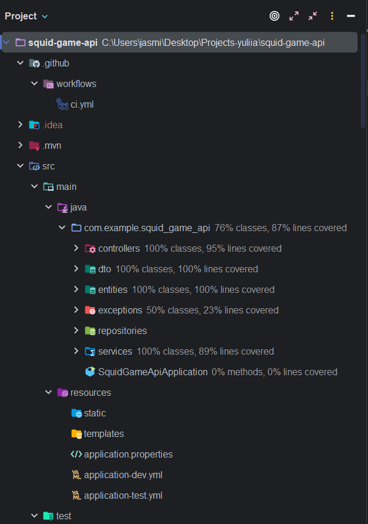
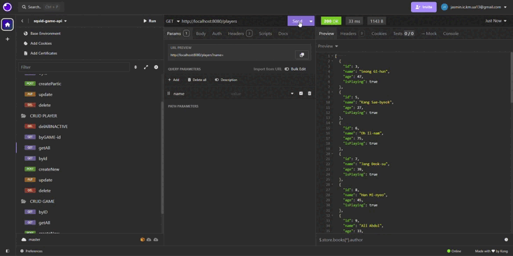
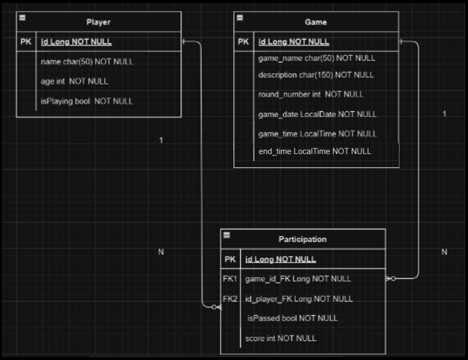
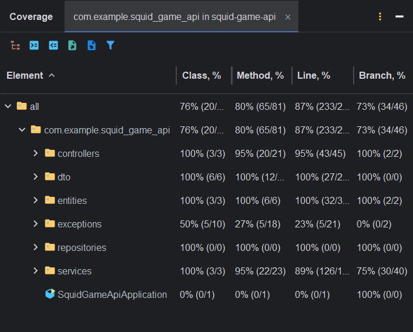

# 🦑 Squid Game — REST API

## 📖 Table of Contents
- [Project Description](#project-description)
- [Key Features](#key-features)
- [Project Structure](#project-structure)
- [API Endpoints](#api-endpoints)
- [Working with Players and Games](#working-with-players-and-games)
- [Technologies Used](#technologies-used)
- [Installation and Setup](#installation-and-setup)
- [Unit and Acceptance Tests](#unit-and-acceptance-tests)

---

## 💡Project Description
This project is a REST API built with Java Spring Boot to manage data about players, games, and participation. The API allows adding, updating, deleting, and retrieving information about games, participants, and task completion statuses.

The API already includes a small database of games that have been added. 
You can:
- Add participants to a game.
- Search for players by name when adding them to a game.
- View all participants associated with a game.
- After the game time has expired, you can make a request that will randomly change the game completion status (true/false). For participants who have passed, points will be awarded. For participants who have not passed, the isPlaying attribute will be set to false, indicating that they are eliminated. Players with the isPlaying status set to false can no longer be added to new games.


## 🚀Key Features
### 🕹️ Player Management
- Add a new player.
- List all players.
- Find a player by ID.
- Find all players by game ID.
- Update player details.
- Delete a player by ID.
- Delete all inactive players.

### 🎮Game Management
- Register a new game.
- List all games.
- Retrieve game information by ID.
- Game statistics.
- Delete a game by ID.

### 📜Participation
- Create game participation.
- Find, update, delete game participation.
- Finalize game
- List winning games.

---

## 📂Project Structure

The project follows the principle of separation of concerns, using three main layers: controllers for handling HTTP requests, services for business logic, and repositories for database interaction. Logic is centralized in services, with controllers kept thin, delegating business logic operations and database interactions. DTOs are used for data transfer between layers, and global exception handling is implemented for consistent error responses. Custom exceptions are employed for domain-specific errors, allowing for more precise and informative error handling. This approach ensures a clear architecture, making the codebase maintainable, scalable, and easy to extend.



---

## 📦API Endpoints 
URL: http://localhost:8080 + endpoint
### Player Endpoints
| Method | Endpoint                 | Description                  |
|--------|--------------------------|------------------------------|
| GET    | `/players`               | Retrieve all players.        |
| GET    | `/players/{id}`          | Retrieve player by ID.       |
| GET    | `/players/game/{idGame}` | Retrieve player by game ID.  |
| POST   | `/players`               | Add a new player.            |
| PUT    | `/players/{id}`          | Update player details.       |
| DELETE | `/players/{id}`          | Delete a player by ID.       |
| DELETE | `players/inactive`       | Delete all inactive players. |

### Game Endpoints
| Method | Endpoint   | Description          |
|--------|-------------|----------------------|
| GET    | `/games`   | Retrieve all games.  |
| GET    | `/games/{id}` | Retrieve game by ID. |
| POST   | `/games`   | Register a new game. |
| PUT    | `/players/{id}` | Update game details. |
| DELETE | `/games/{id}` | Delete a game by ID. |

### Participation Endpoints
| Method | Endpoint | Description                               |
|--------|-----|-------------------------------------------|
| GET    | `/participations` | Retrieve all participatios connections    |
| GET    | `/participations/{id}` | Retrieve participatios connections by ID. |
| POST   | `/participations` | Add a new player-participatio connection. |
| PUT    | `/participations/{id}` | Update participatio connection.           |
| PUT    | `/participations/finalize/{id}` | Finalize game participation.              |
| DELETE | `/participations/{id}` | Delete participation connection by ID.    |

---

## ✍️Working with Players and Games

### Registering a Player (Request)
**POST** `http://localhost:8080/players`

```json
{
	"name": "Yoon Bo-ra",
	"age": 24
}
```
### Registering a Games (Request)
**POST** `http://localhost:8080/games`

```json
{
  "gameName": "Target Throw",
  "description": "Players must throw objects to hit a bullseye. Missing the target has severe consequences.",
  "roundNumber": 1,
  "gameDate": "2025-03-19",
  "gameTime": "14:00:00",
  "endTime": "14:30:00"
}
```
### 💻 API Testing
- Use **Postman** or **Insomnia** for testing the API.
- Import the collection of endpoints from the file [SquidGame.insomnia_collection.json](src/main/java/com/example/squid_game_api/utils/Insomnia_2024-12-19.json).
  
  
---

## 🛠️Technologies Used
- **Java 21**: Programming language.
- **Spring Boot**: Framework for building REST APIs.
- **Maven**: Build tool.
- **PostgreSQL**: Database, deployed using Docker.
- **Docker**: Used for containerizing the PostgreSQL database.
- **Docker Compose**: Orchestrates multi-container Docker applications.
- **H2 Database**: In-memory database for temporary data storage.
- **Insomnia**: Tool for testing APIs.

---

## ⚙️Installation and Setup

1. **Clone the repository**:

```bash
git clone https://github.com/YuliiaBi1a/squid-game-api.git
```

2. **Configure the database in the application properties**:
- This project has two different configurations for databases:
- Test Environment (H2 in-memory database): Configured in resources/application-test.yml.
- Development Environment (PostgreSQL via Docker): Configured in resources/application-dev.yml.
- For testing, the application-test.yml contains the configuration for an in-memory H2 database.
- For development, the application-dev.yml contains the configuration for a PostgreSQL database deployed using Docker.

  

3. **Run the application**:
To run the application, first, make sure you have the correct profile active. You can specify the active profile by adding the following to your application.properties (or application-dev.yml and application-test.yml for environment-specific settings):
-For test environment:
```bash
mvn spring-boot:run -Dspring.profiles.active=test
```
-For development environment:
```bash
mvn spring-boot:run -Dspring.profiles.active=dev
```
---
### 🚀 CI/CD Pipeline
This project uses GitHub Actions for continuous integration and continuous deployment (CI/CD). There are two separate pipelines configured for testing and development environments:

- **Test Pipeline (H2 Database)**: This pipeline runs the unit and integration tests using an in-memory H2 database. It ensures that the project works correctly in a test environment.

- **Development Pipeline**: This pipeline runs in a development environment, where the project is built and deployed with a PostgreSQL containerized database using Docker. It tests the application in a more realistic environment.

Both pipelines ensure that any changes made to the repository are properly tested and validated before being deployed.

---
### 🛠️ Setting Up Docker Compose
*To run the PostgreSQL database with Docker for the development environment, you can use Docker Compose.*

1. Install Docker if you haven’t already.

2. Create a Docker Compose configuration: In your project, there should be a docker-compose.yml file for configuring and starting the PostgreSQL container.

Example docker-compose.yml:

```yaml
version: '3.8'
services:
  db:
    image: postgres:17
    container_name: squid_game_postgres_db
    environment:
      POSTGRES_USER: adm
      POSTGRES_PASSWORD: adm
      POSTGRES_DB: squid_game_db
    ports:
      - "5432:5432"
    volumes:
      - postgres_data:/var/lib/postgresql/data
    networks:
      - springboot_network

volumes:
  postgres_data:

networks:
  springboot_network:
```
3. Run Docker Compose:

After setting up docker-compose.yml, you can start the PostgreSQL container with the following command:

```bash
docker-compose up
```
This command will download the necessary PostgreSQL image, start the container, and expose the database on port 5432.

4. Run the application with the development profile:

After PostgreSQL is up and running, you can start the application in development mode with:

```bash
mvn spring-boot:run -Dspring.profiles.active=dev
```

---

## 🧪Unit and Acceptance Tests
The project includes both unit tests and acceptance tests to ensure the correctness and reliability of the application. Unit tests are written using JUnit 5 and are focused on testing individual components such as services and helper methods. MockMvc is used for testing the REST API endpoints, allowing for simulation of HTTP requests and validation of responses without actually starting a server. Acceptance tests ensure that the system works as expected in an integrated environment, testing the full flow of data and interactions between components. Mockito is used for mocking dependencies in unit tests to isolate the logic and make the tests more efficient and focused.



---

---

#### Project documentation 
- First run App.
- Use [link](http://localhost:8080/swagger-ui/index.html) to read project documentation genereted by Springdoc OpenAPI.

#### Project made by [Yuliia Bila](https://github.com/YuliiaBi1a)
( ˶ˆ ᗜ ˆ˵ ) 
